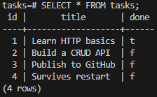

# Task API

A small to-do list API built with Python and FastAPI. It supports full CRUD (create, read, update, delete) on tasks stored in a PostgreSQL database that runs in Docker. The whole stack (API and database) starts with one command.

Built for the FlyRank Internship, Backend Track. Storage evolved in three steps without changing the endpoints: in-memory (A1), SQLite (A2), containerized Postgres (A3).

## Requirements

- Docker Desktop (or Docker Engine with the Compose plugin)

No Python or Postgres installation is needed to run it.

## Run everything with one command

```bash
git clone https://github.com/AbhinavBh18/task-api
cd task-api
cp .env.example .env
docker compose up
```

(On Windows PowerShell, use `copy .env.example .env` instead of `cp`.)

The API runs at `http://localhost:8000`. Swagger UI is at `http://localhost:8000/docs`.

On first run the app creates the `tasks` table and seeds three example tasks. The seed runs only when the table is empty, so restarting never duplicates them.

Stop with `Ctrl+C`, then `docker compose down`. Your data is kept in a Docker volume, so it is still there on the next `docker compose up`. To wipe it, run `docker compose down -v`.

## Configuration

Settings live in `.env` (git-ignored). `.env.example` lists every key:

| Variable | Purpose |
|----------|---------|
| `POSTGRES_USER` | Database user |
| `POSTGRES_PASSWORD` | Database password |
| `POSTGRES_DB` | Database name |
| `DATABASE_URL` | Connection string used when running the app outside Docker |

Inside Docker Compose, the API builds its own connection string from these values and reaches the database through the service name `db`. No credentials are hardcoded in the code or in `compose.yaml`.

## Endpoints

| Method | Path | Description | Success | Errors |
|--------|------|-------------|---------|--------|
| GET | `/` | API info | 200 | |
| GET | `/health` | Health check | 200 | |
| GET | `/tasks` | List all tasks | 200 | |
| GET | `/tasks/{id}` | Get one task | 200 | 404 |
| POST | `/tasks` | Create a task (`{"title": "..."}`) | 201 | 400 |
| PUT | `/tasks/{id}` | Update title and/or done | 200 | 400, 404 |
| DELETE | `/tasks/{id}` | Delete a task | 204 | 404 |

Errors return JSON like `{"error": "Task not found"}`. All SQL uses parameterized queries (`%s` placeholders), so user input is never glued into SQL strings.

## Example request

HTTP/1.1 200 OK
date: Tue, 06 Oct 2026 18:28:15 GMT
server: uvicorn
content-length: 198
content-type: application/json

## Swagger UI


## The data in Postgres



## Persistence

Postgres stores its files in the named volume `taskdata`, which lives outside the container. `docker compose down` removes the containers but keeps the volume, so tasks survive a full restart.

## Running without Docker (optional)

Start a Postgres database, set `DATABASE_URL` in `.env` to point at it (host `localhost`), then:

```bash
python -m venv venv
venv\Scripts\activate        # Mac/Linux: source venv/bin/activate
pip install -r requirements.txt
fastapi dev main.py
```

## Project structure

- `main.py`: FastAPI routes and request validation
- `db.py`: all database code (connection, table creation, seeding, queries)
- `Dockerfile`: builds the API image
- `compose.yaml`: runs the API and Postgres together
- `.env.example`: template for the settings file
- `requirements.txt`: dependencies