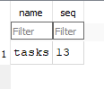

# Task API

A small to-do list API built with Python and FastAPI. It supports full CRUD (create, read, update, delete) on tasks stored in a SQLite database, with interactive docs in Swagger UI.

Built for the FlyRank Internship, Backend Track. Week 2 built the API with in-memory storage; Week 3 moved the storage to SQLite without changing the endpoints.

## Requirements

- Python 3.10 or newer

## Install and run

```bash
git clone https://github.com/AbhinavBh18/task-api
cd task-api
python -m venv venv
```

Start Postgres in Docker:

```
docker run --name taskdb -e POSTGRES_PASSWORD=dev -e POSTGRES_DB=tasks -p 5432:5432 -v taskdata:/var/lib/postgresql/data -d postgres:16
```

Open a SQL prompt inside it:

```
docker exec -it taskdb psql -U postgres -d tasks
```
Activate the virtual environment:

- Windows (PowerShell): `venv\Scripts\activate`
- Mac/Linux: `source venv/bin/activate`

Then install and start the server:

```bash
pip install -r requirements.txt
fastapi dev main.py
```

The API runs at `http://localhost:8000`. Swagger UI is at `http://localhost:8000/docs`.

No database setup is needed. On first run the app creates `tasks.db`, creates the `tasks` table, and seeds three example tasks.

## Why SQLite

- **Single file:** the whole database is one file, `tasks.db`.
- **Zero setup:** no database server to install, configure or run. Python includes the `sqlite3` module.
- **Persistence:** data is saved to disk, so it survives server restarts (unlike the in-memory list in Week 2).

SQLite is a good fit for a small project like this. A larger app with many simultaneous writers would use something like PostgreSQL.

## Where the database lives

`tasks.db` is created automatically next to `db.py` the first time the app runs. It is listed in `.gitignore`, so each clone starts with a fresh database containing the three seeded tasks. The seed runs only when the table is empty, so restarting never duplicates the examples.

## Endpoints

| Method | Path | Description | Success | Errors |
|--------|------|-------------|---------|--------|
| GET | `/` | API info | 200 | |
| GET | `/health` | Health check | 200 | |
| GET | `/tasks` | List all tasks | 200 | |
| GET | `/tasks/{id}` | Get one task | 200 | 404 |
| POST | `/tasks` | Create a task (`{"title": "..."}`) | 201 | 400 |
| PUT | `/tasks/{id}` | Update title and/or done | 200 | 400, 404 |
| DELETE | `/tasks/{id}` | Delete a task | 204 | 404 |

Errors return JSON like `{"error": "Task not found"}`. All SQL uses parameterized queries (`?` placeholders), so user input is never glued into SQL strings.

## Example request

```
PASTE YOUR curl.exe -i OUTPUT HERE
```

## Swagger UI


## The database in DB Browser



Example query I ran by hand in DB Browser's Execute SQL tab:

```sql
SELECT COUNT(*) FROM tasks;
```

It returned `3`, the number of seeded tasks. After changing data in DB Browser and clicking Write Changes, `GET /tasks` showed the change immediately, because the API and DB Browser read the same file.

## Project structure

- `main.py`: FastAPI routes and request validation
- `db.py`: all database code (connection, table creation, seeding, queries)
- `requirements.txt`: dependencies