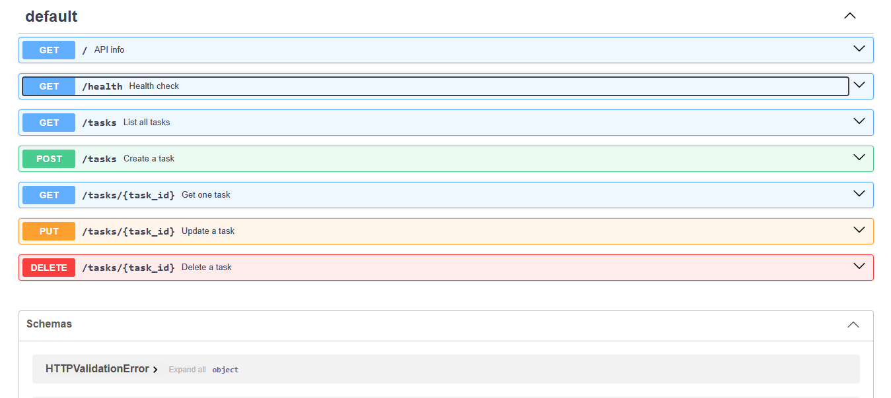

# Task API

A small to-do list API built with Python and FastAPI. It supports full CRUD (create, read, update, delete) on tasks stored in memory, with interactive docs in Swagger UI.

Built for the FlyRank Internship, Backend Track, Week 2 (Assignment A1).

## Requirements

- Python 3.10 or newer

## Install and run

```bash
git clone <https://github.com/AbhinavBh18/task-api>
cd task-api
python -m venv venv
```

Activate the virtual environment:

- Windows (PowerShell): `venv\Scripts\activate`
- Mac/Linux: `source venv/bin/activate`

Then install and start the server:

```bash
pip install -r requirements.txt
fastapi dev main.py
```

The API runs at `http://localhost:8000`. Swagger UI is at `http://localhost:8000/docs`.

## Endpoints

| Method | Path | Description | Success | Errors |
|--------|------|-------------|---------|--------|
| GET | `/` | API info | 200 | |
| GET | `/health` | Health check | 200 | |
| GET | `/tasks` | List all tasks | 200 | |
| GET | `/tasks/{id}` | Get one task | 200 | 404 |
| POST | `/tasks` | Create a task (`{"title": "..."}`) | 201 | 400 |
| PUT | `/tasks/{id}` | Update title and/or done | 200 | 400, 404 |
| DELETE | `/tasks/{id}` | Delete a task | 204 | 404 |

Errors return JSON like `{"error": "Task 99 not found"}`.

## Example request

HTTP/1.1 200 OK
date: Mon, 05 Oct 2026 15:42:35 GMT
server: uvicorn
content-length: 48
content-type: application/json

{"id":1,"title":"Learn HTTP basics","done":true}

## Swagger UI



## Notes

Data is stored in memory only, so it resets whenever the server restarts. A database comes next week.
